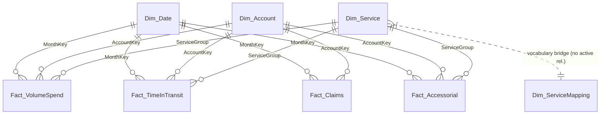

# Model relationships

Star schema. Every relationship is single-direction (dimension filters fact) unless
explicitly noted. Bi-directional filtering is not used anywhere in this model: with
three fact tables at different grains it introduces ambiguous filter paths that
silently change measure results depending on which visual a user clicks first.

## Diagram

## Relationship table

| From (1) | To (*) | Key | Cardinality | Direction | Active |
|---|---|---|---|---|---|
| `Dim_Date` | `Fact_VolumeSpend` | `MonthKey` | 1:* | Single | Yes |
| `Dim_Date` | `Fact_TimeInTransit` | `MonthKey` | 1:* | Single | Yes |
| `Dim_Date` | `Fact_Claims` | `MonthKey` | 1:* | Single | Yes |
| `Dim_Date` | `Fact_Accessorial` | `MonthKey` | 1:* | Single | Yes |
| `Dim_Account` | `Fact_VolumeSpend` | `AccountKey` | 1:* | Single | Yes |
| `Dim_Account` | `Fact_TimeInTransit` | `AccountKey` | 1:* | Single | Yes |
| `Dim_Account` | `Fact_Claims` | `AccountKey` | 1:* | Single | Yes |
| `Dim_Account` | `Fact_Accessorial` | `AccountKey` | 1:* | Single | Yes |
| `Dim_Service` | `Fact_VolumeSpend` | `ServiceGroup` | 1:* | Single | Yes |
| `Dim_Service` | `Fact_TimeInTransit` | `ServiceGroup` | 1:* | Single | Yes |
| `Dim_Service` | `Fact_Accessorial` | `ServiceGroup` | 1:* | Single | Yes |
| `Dim_Service` | `Fact_Claims` | — | — | — | **Deliberately absent** |

## The three decisions worth explaining

### 1. Why `Dim_ServiceMapping` is not the table the model relates to

`Dim_ServiceMapping` has grain `(SourceSystem, RawProduct)` — 42 rows covering two
different product vocabularies. Volume & Net Spend names a service
`NDA REG / EXPRESS PKG`; Time-in-Transit names the same service `NEXT DAY AIR`.
Neither vocabulary is a superset of the other, and `RawProduct` is not unique across
the table, so it cannot serve as the one side of a relationship.

The mapping table is applied **in Power Query**, where each fact query joins to a
filtered copy of it (`SourceSystem = "VnS"` or `"TnT"`) and materialises a
`ServiceGroup` column. The model then relates on `ServiceGroup` via `Dim_Service`,
which has one row per group.

This is what makes cost and reliability for the same service land on the same row of
the scorecard. Without it there is no service recommendation — only two unrelated
lists.

Keep `Dim_ServiceMapping` loaded but hidden from the report view. It is needed for
the Data Quality page's mapping inventory and it documents the transformation, but it
must never appear in a slicer.

### 2. Why there is no relationship from `Dim_Service` to `Fact_Claims`

There is no key to join on. The claims extract carries Sub-Parent, Account and Claims
Category — no product, service, or tracking number.

The tempting workaround is a many-to-many relationship through `Dim_Account`, or a
bi-directional filter that lets a service slicer reach the claims table. Both produce
numbers. Neither produces *meaning*: filtering claims by service through an account
path returns "claims for accounts that used this service", which for an account using
five services returns the same claim count five times over. Anyone reading the visual
will take it as claims caused by that service.

The relationship is left absent so that a service slicer visibly does nothing to a
claims visual. A blank is a correct answer to an unanswerable question; a plausible
wrong number is not.

Fixing this properly requires a service or tracking-number field on the claims export.
It is item 1 on the automation backlog in `docs/05_automation_api_path.md`.

### 3. Why `Fact_TimeInTransit` and `Fact_VolumeSpend` are not merged

They are different populations at different grains:

- `Fact_TimeInTransit` is a **Shipper View** — packages the firm despatched.
- `Fact_VolumeSpend` is a **Payor View** — packages the firm was billed for.

For March these are 67,091 and 68,527 respectively: close, consistently so, but not
equal, and the gap is real rather than an error. Merging them forces one denominator
onto both and quietly changes either the on-time rate or the cost per shipment.

They stay separate, share the `Dim_Date` / `Dim_Account` / `Dim_Service` conformed
dimensions, and `[Measured vs Billed Coverage %]` reports the gap on the Data Quality
page.

## Model hygiene checklist

- [ ] `Dim_Date` marked as a date table on `[DateKey]`.
- [ ] `MonthName` and `MonthYearLabel` sorted by `[SortOrder]` — otherwise every month
      axis renders alphabetically (Apr, Aug, Dec, Feb…).
- [ ] All raw numeric fact columns hidden; only measures exposed to the report view.
- [ ] `Fact_TimeInTransit[OnTimePercent]` **not loaded at all** — see the note in
      `03_Fact_TimeInTransit.m`. Its presence invites averaging a percentage.
- [ ] `AccountKey` / `MonthKey` hidden on both sides of every relationship.
- [ ] Measures organised into display folders matching the `dax/` file numbering.
- [ ] No bi-directional relationships. No `USERELATIONSHIP` in any measure.
- [ ] Every currency measure formatted `$#,##0`; every rate `0.0%`; every per-10k rate
      `0.0`.
